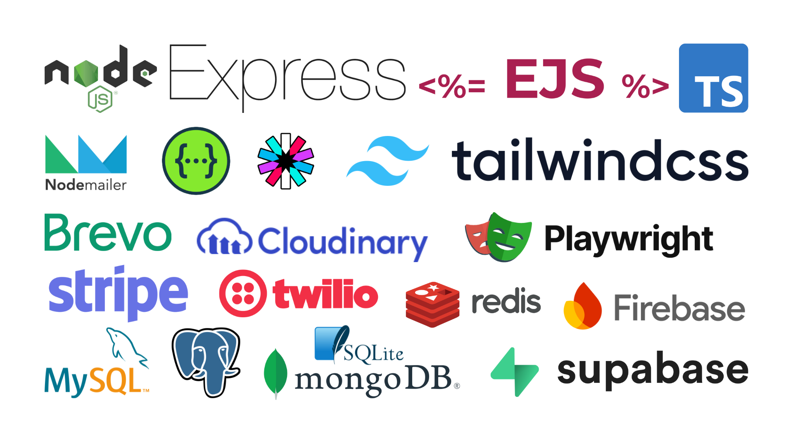

# Production Grade Express + TypeScript Template

### Features

##### Core Technologies
- [ ] TypeScript
- [ ] Node.js
- [ ] Express.js
- [ ] Playwright
- [ ] Swagger UI

##### API Types
- [ ] REST

##### Authentication
- [ ] Username password authentication
- [ ] Role Based Access Control
- [ ] API Key Authorization
- [ ] Cookies
- [ ] Session
- [ ] JWT
- [ ] One-Time Passcode (OTP)

##### TypeScript
- [ ] TypeScript support
- [ ] Convert project to ESM syntax
- [ ] Convert project to TypeScript

##### API Documentation
- [ ] Swagger API Docs

##### Routes
- [ ] Static HTML Routes
- [ ] EJS Pages Routes
- [ ] Playwright Test Report Route
- [ ] Swagger UI Route

##### Styling
- [ ] TailwindCSS

##### Static Assets
- [ ] Static assets serving (images, etc.)

##### Data Validation
- [ ] Server-side Form Validation

##### Database
- [ ] MySQL config
- [ ] PostgreSQL config
- [ ] SQLite support
- [ ] MongoDB config
- [ ] Redis config
- [ ] Firebase config
- [ ] Supabase config

##### Logging
- [ ] Dev logging
- [ ] Stage logging
- [ ] Production logging

##### Utility Functions
- [ ] Email Helper
- [ ] Password Hashing
- [ ] File upload
- [ ] File compression

##### CDN
- [ ] BunnyCDN
- [ ] Cloudinary
- [ ] Uploadcare
- [ ] Cloudimage
- [ ] Amazon CloudFront
- [ ] Cloudflare CDN
- [ ] Akamai (formerly Linode)
- [ ] Fastly

##### Payments
- [ ] Stripe

##### SMS
- [ ] Twilio

##### Emails
- [ ] Brevo
- [ ] MailerSend
- [ ] Mailgun
- [ ] SendGrid
- [ ] AWS SES
- [ ] Courier
- [ ] Resend
- [ ] Postmark

##### Testing
- [ ] Playwright API tests
- [ ] Playwright Views tests
- [ ] Playwright Test reports

##### Security
- [ ] Helmet.js API Security
- [ ] Firewall
- [ ] Reverse Proxy

##### Deployment
- [ ] AWS deployment config
- [ ] GCP deployment config
- [ ] Azure deployment config
- [ ] Railway deployment config
- [ ] Vercel deployment config
- [ ] DigitalOcean deployment config
- [ ] Netlify deployment config
- [ ] Hostinger deployment config
- [ ] Heroku deployment config
- [ ] BlueHost deployment config
- [ ] Cloudflare deployment config
- [ ] Nginx reverse proxy
- [ ] Pm2
- [ ] CentOS
- [ ] Docker

##### CI/CD
- [ ] GitHub Actions
- [ ] CircleCI
- [ ] TravisCI